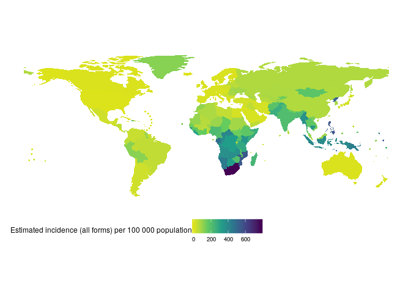
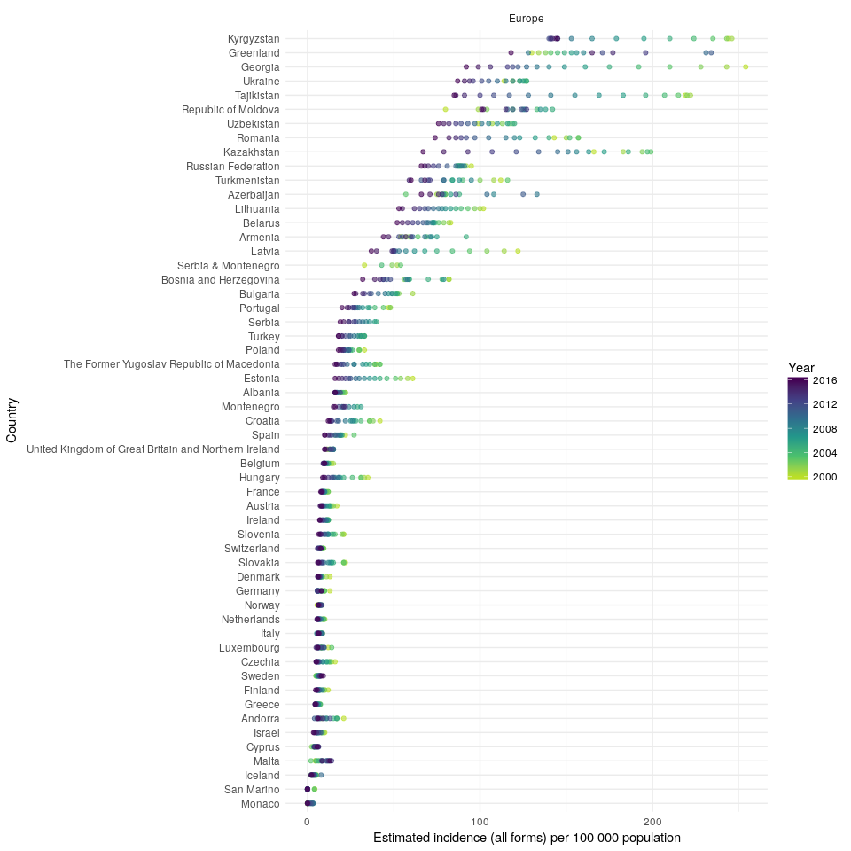
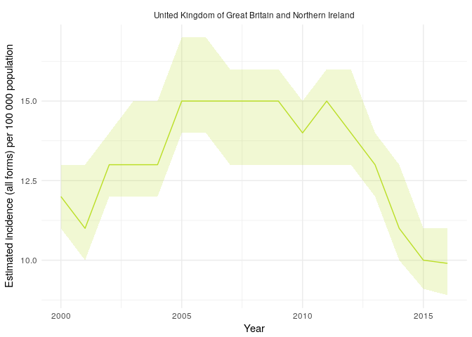

Get TB Data in R
================

[](https://cran.r-project.org/package=getTBinR) [](https://travis-ci.org/seabbs/getTBinR) [](https://codecov.io/github/seabbs/getTBinR?branch=master) [](https://ci.appveyor.com/project/seabbs/getTBinR)

Quickly and easily import analysis ready TB burden data, from the World Health Orgnaisation (WHO), into R. The aim of the package is to speed up access to high quality TB burden data, using a simple R interface. Generic plotting functions are provided to allow for rapid graphical exploration of the WHO TB data. This package is inspired by a blog [post](https://incidental-ideas.org/2017/03/03/who-tuberculosis-data-ggplot2/), which looked at WHO TB incidence rates. See [here](http://www.who.int/about/copyright/en/) for the WHO data permissions.

Installation
------------

You can install getTBinR from github with:

``` r
# install.packages("devtools")
devtools::install_github("seabbs/getTBinR")
```

Quick start
-----------

Lets get started quickly by mapping and then plotting TB incidence rates in the United Kingdom. First map global TB incidence rates in 2016,

``` r
getTBinR::map_tb_burden(metric = "e_inc_100k",
                        year = 2016)
```



Then compare TB incidence rates in the UK to TB incidence rates in other countries in the region,

``` r
getTBinR::plot_tb_burden_overview(metric = "e_inc_100k",
                                  countries = "United Kingdom",
                                  compare_to_region = TRUE,
                                  interactive = FALSE)
```



Finally plot TB incidence rates over time in the United Kingdom.

``` r
getTBinR::plot_tb_burden(metric = "e_inc_100k",
                         countries = "United Kingdom",
                         facet = "country",
                         interactive = FALSE)
```



See [Getting Started](https://www.samabbott.co.uk/getTBinR/articles/intro.html) and [Functions](https://www.samabbott.co.uk/getTBinR/reference/index.html) for more details of the functions used (note the fuzzy country matching, `map_tb_burden`, `plot_tb_burden_overview` and `plot_tb_burden` will try to exactly match your country request and if that fails will search for partial matches) and for more package functionality. We could make these plots interactive by specifying `interactive = TRUE`

Additional Functionality
------------------------

File an issue [here](https://github.com/seabbs/getTBinR/issues) if there is a feature, or a dataset, that you think is missing from the package, or better yet submit a pull request!

Docker
------

This package has been developed in docker based on the `rocker/tidyverse` image, to access the development environment enter the following at the command line (with an active docker daemon running),

``` bash
docker pull seabbs/gettbinr
docker run -d -p 8787:8787 -e USER=getTBinR -e PASSWORD=getTBinR --name getTBinR seabbs/gettbinr
```

The rstudio client can be accessed on port `8787` at `localhost` (or your machines ip). The default username is getTBinR and the default password is getTBinR.
