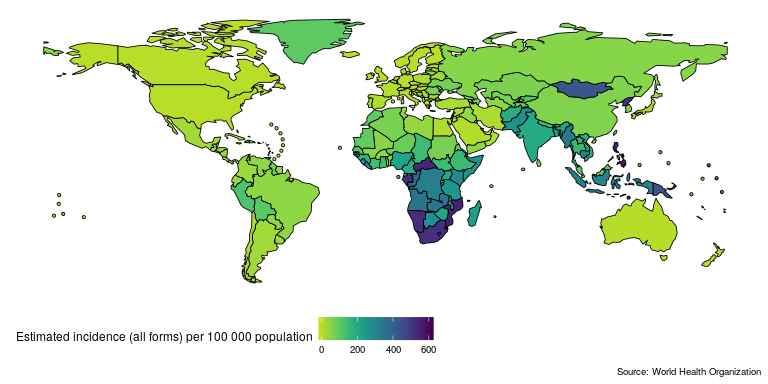
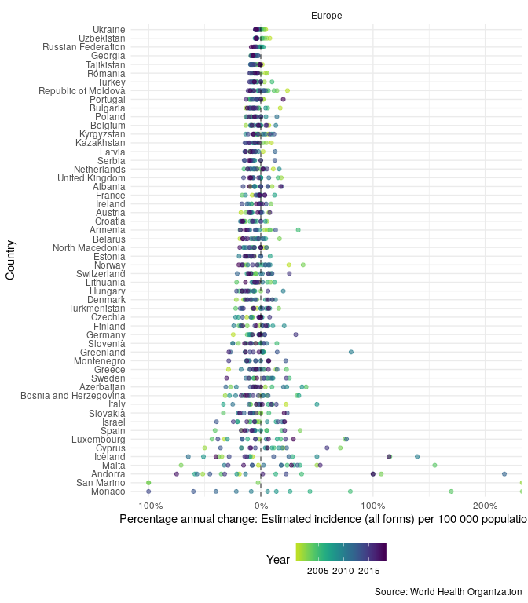
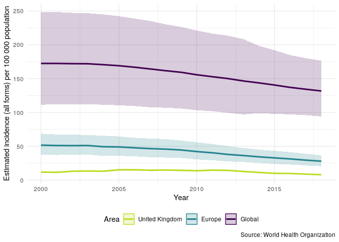
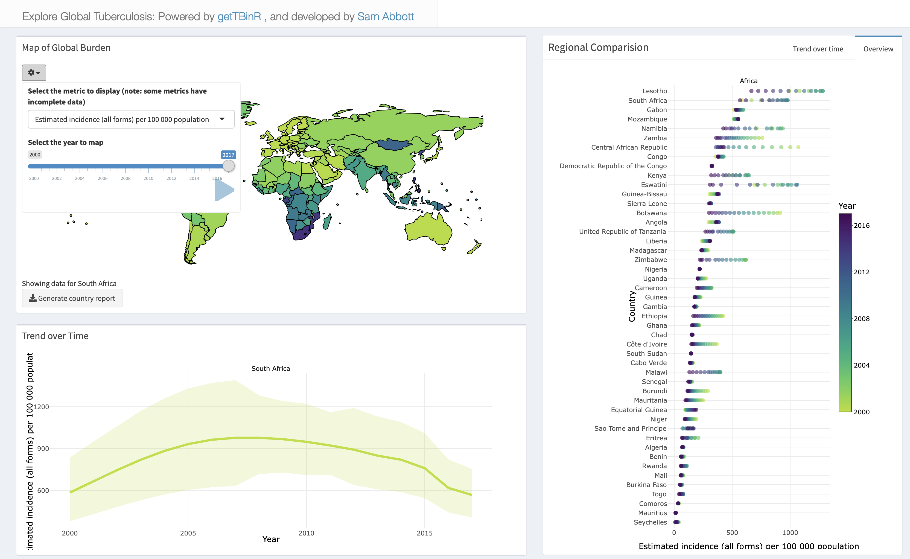
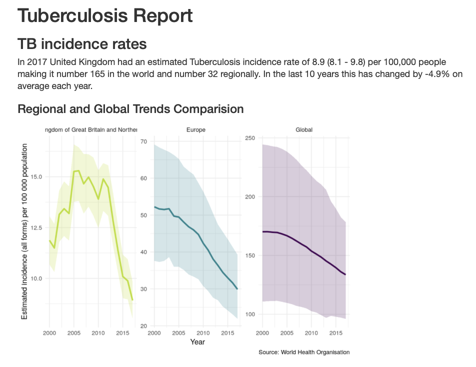

Get TB Data in R 
====================================================================================

[](https://CRAN.R-project.org/package=getTBinR) [](https://github.com/getTBinR) [](https://www.samabbott.co.uk/getTBinR/) [](https://www.samabbott.co.uk/getTBinR/dev) [![badge](https://img.shields.io/badge/launch-getTBinR-579ACA.svg?logo=)](https://mybinder.org/v2/gh/seabbs/getTBinR/master?urlpath=rstudio) [](https://travis-ci.org/seabbs/getTBinR) [](https://ci.appveyor.com/project/seabbs/getTBinR) [](https://codecov.io/github/seabbs/getTBinR?branch=master) [](https://cran.r-project.org/package=getTBinR) [](https://cran.r-project.org/package=getTBinR) [](https://zenodo.org/badge/latestdoi/112591837)

Quickly and easily import analysis ready TB burden data, from the World Health Organisation (WHO), into R. The aim of the package is to speed up access to high quality TB burden data, using a simple R interface. Generic plotting functions are provided to allow for rapid graphical exploration of the WHO TB data. A shiny dashboard is built in to showcase package functionality. An automated report allows country level TB burden to be summarised. See [here](http://www.who.int/about/copyright/en/) for the WHO data permissions. For help getting started see the [Getting Started](https://www.samabbott.co.uk/getTBinR/articles/intro.html) vignette and for a case study using the package see the [Exploring Global Trends in Tuberculosis Incidence Rates](https://www.samabbott.co.uk/getTBinR/articles/case_study_global_trends.html) vignette.

Installation
------------

Install the CRAN version:

``` r
install.packages("getTBinR")
```

Alternatively install the development version from GitHub:

``` r
# install.packages("devtools")
devtools::install_github("seabbs/getTBinR")
```

Quick start
-----------

Lets get started quickly by mapping and then plotting TB incidence rates in the United Kingdom. First map the most recently available global TB incidence rates (this will also download and save both the TB burden data and its data dictionary, if they are not found locally, to R's temporary directory),

``` r
getTBinR::map_tb_burden(metric = "e_inc_100k")
#> Downloading data from: https://extranet.who.int/tme/generateCSV.asp?ds=estimates
#> Saving data to: /tmp/RtmpeCuWDx/TB_burden.rds
#> Downloading data from: https://extranet.who.int/tme/generateCSV.asp?ds=mdr_rr_estimates
#> Saving data to: /tmp/RtmpeCuWDx/MDR_TB.rds
#> Joining TB burden data and MDR TB data.
#> Downloading data from: https://extranet.who.int/tme/generateCSV.asp?ds=dictionary
#> Saving data to: /tmp/RtmpeCuWDx/TB_data_dict.rds
#> 1 results found for your variable search for e_inc_100k
```



Then compare TB incidence rates in the UK to TB incidence rates in other countries in the region,

``` r
getTBinR::plot_tb_burden_overview(metric = "e_inc_100k",
                                  countries = "United Kingdom",
                                  compare_to_region = TRUE,
                                  interactive = FALSE)
#> Loading data from: /tmp/RtmpeCuWDx/TB_burden.rds
#> Loading data from: /tmp/RtmpeCuWDx/MDR_TB.rds
#> Joining TB burden data and MDR TB data.
#> Loading data from: /tmp/RtmpeCuWDx/TB_data_dict.rds
#> 1 results found for your variable search for e_inc_100k
```


In order to compare the changes in incidence rates over time, in the region, plot the annual percentage change,

``` r
getTBinR::plot_tb_burden_overview(metric = "e_inc_100k",
                                  countries = "United Kingdom",
                                  compare_to_region = TRUE,
                                  annual_change = TRUE,
                                  interactive = FALSE)
#> Loading data from: /tmp/RtmpeCuWDx/TB_burden.rds
#> Loading data from: /tmp/RtmpeCuWDx/MDR_TB.rds
#> Joining TB burden data and MDR TB data.
#> Loading data from: /tmp/RtmpeCuWDx/TB_data_dict.rds
#> 1 results found for your variable search for e_inc_100k
```



Now plot TB incidence rates over time in the United Kingdom, compared to TB incidence rates in Europe and globally.

``` r
getTBinR::plot_tb_burden_summary(metric = "e_inc_num",
                                 metric_label = "e_inc_100k",
                                 countries = "United Kingdom",
                                 legend = "top",
                                 compare_all_regions = FALSE,
                                 compare_to_region = TRUE,
                                 compare_to_world = TRUE,
                                 interactive = FALSE)
#> Loading data from: /tmp/RtmpeCuWDx/TB_data_dict.rds
#> 1 results found for your variable search for e_inc_100k
#> Extracting data for specified countries
#> Loading data from: /tmp/RtmpeCuWDx/TB_burden.rds
#> Loading data from: /tmp/RtmpeCuWDx/MDR_TB.rds
#> Joining TB burden data and MDR TB data.
#> Loading data from: /tmp/RtmpeCuWDx/TB_data_dict.rds
#> 1 results found for your variable search for e_inc_num
#> Loading data from: /tmp/RtmpeCuWDx/TB_burden.rds
#> Loading data from: /tmp/RtmpeCuWDx/MDR_TB.rds
#> Joining TB burden data and MDR TB data.
#> Loading data from: /tmp/RtmpeCuWDx/TB_data_dict.rds
#> 1 results found for your variable search for e_inc_num
#> Loading data from: /tmp/RtmpeCuWDx/TB_burden.rds
#> Loading data from: /tmp/RtmpeCuWDx/MDR_TB.rds
#> Joining TB burden data and MDR TB data.
#> Loading data from: /tmp/RtmpeCuWDx/TB_data_dict.rds
#> 1 results found for your variable search for e_inc_num
```



Finally we repeat the above plot but this time only for the UK - this allows us to get a clear picture of trends in TB incidence rates in the UK.

``` r
getTBinR::plot_tb_burden(metric = "e_inc_100k",
                         countries = "United Kingdom",
                         interactive = FALSE)
#> Loading data from: /tmp/RtmpeCuWDx/TB_burden.rds
#> Loading data from: /tmp/RtmpeCuWDx/MDR_TB.rds
#> Joining TB burden data and MDR TB data.
#> Loading data from: /tmp/RtmpeCuWDx/TB_data_dict.rds
#> 1 results found for your variable search for e_inc_100k
```


See [Functions](https://www.samabbott.co.uk/getTBinR/reference/index.html) for more details of the functions used (note the fuzzy country matching, `map_tb_burden`, `plot_tb_burden_overview`, `plot_tb_burden_summary` and `plot_tb_burden` will try to exactly match your country request and if that fails will search for partial matches) and for more package functionality. We could make these plots interactive by specifying `interactive = TRUE`

Shiny Dashboard
---------------

To explore the package functionality in an interactive session, or to investigate TB without having to code extensively in R, a shiny dashboard has been built into the package. This can either be used locally using,

``` r
getTBinR::run_tb_dashboard()
```

Or accessed [online](http://www.seabbs.co.uk/shiny/ExploreGlobalTB). Any metric in the WHO data can be explored, with country selection using the built in map, and animation possible by year.



Country Report
--------------

To get a detailed overview of TB in a country of your choice run the following, alternatively available from the built in dashboard above.

``` r
## Code saves report into your current working directory
render_country_report(country = "United Kingdom", save_dir = ".")
```



Contributing
------------

File an issue [here](https://github.com/seabbs/getTBinR/issues) if there is a feature, or a dataset, that you think is missing from the package, or better yet submit a pull request!

Please note that the `getTBinR` project is released with a [Contributor Code of Conduct](.github/CODE_OF_CONDUCT.md). By contributing to this project, you agree to abide by its terms.

Docker
------

This package has been developed in docker based on the `rocker/tidyverse` image, to access the development environment enter the following at the command line (with an active docker daemon running),

``` bash
docker pull seabbs/gettbinr
docker run -d -p 8787:8787 -e USER=getTBinR -e PASSWORD=getTBinR --name getTBinR seabbs/gettbinr
```

The rstudio client can be accessed on port `8787` at `localhost` (or your machines ip). The default username is getTBinR and the default password is getTBinR. Alternatively, access the development environment via [binder](https://mybinder.org/v2/gh/seabbs/getTBinR/master?urlpath=rstudio).
