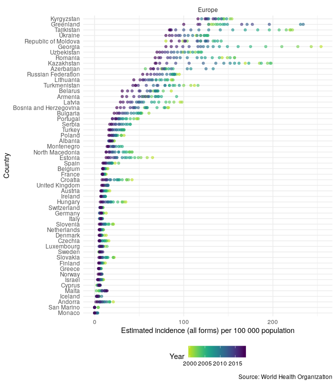
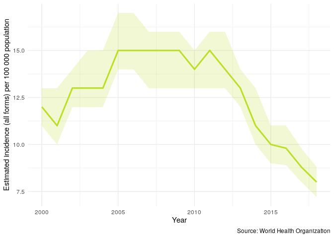

# getTBinR: Access and Summarise World Health Organisation Tuberculosis Data 

[](https://CRAN.R-project.org/package=getTBinR)
[](https://github.com/getTBinR)
[](https://www.samabbott.co.uk/getTBinR/)
[](https://www.samabbott.co.uk/getTBinR/dev)
[](https://mybinder.org/v2/gh/seabbs/getTBinR/master?urlpath=rstudio)
[](https://travis-ci.org/seabbs/getTBinR)
[](https://ci.appveyor.com/project/seabbs/getTBinR)
[](https://codecov.io/github/seabbs/getTBinR?branch=master)
[](https://cran.r-project.org/package=getTBinR)
[](https://cran.r-project.org/package=getTBinR)
[](https://zenodo.org/badge/latestdoi/112591837)
[](https://doi.org/10.21105/joss.01260)

Quickly and easily import analysis ready Tuberculosis (TB) burden data,
from the World Health Organisation (WHO), into R. The aim of `getTBinR`
is to allow researchers, and other interested individuals, to quickly
and easily gain access to a detailed TB data set and to start using it
to derive key insights. It provides a consistent set of tools that can
be used to rapidly evaluate hypotheses on a widely used data set before
they are explored further using more complex methods or more detailed
data. These tools include: generic plotting and mapping functions; a
data dictionary search tool; an interactive shiny dashboard; and an
automated, country level, TB report. For newer R users, this package
reduces the barrier to entry by handling data import, munging, and
visualisation. All plotting and mapping functions are built with
`ggplot2` so can be readily extended. See
[here](http://www.who.int/about/copyright/en/) for the WHO data
permissions. For help getting started see the [Getting
Started](https://www.samabbott.co.uk/getTBinR/articles/intro.html)
vignette and for a case study using the package see the [Exploring
Global Trends in Tuberculosis Incidence
Rates](https://www.samabbott.co.uk/getTBinR/articles/case_study_global_trends.html)
vignette.

## Installation

Install the CRAN version:

``` r
install.packages("getTBinR")
```

Alternatively install the development version from GitHub:

``` r
# install.packages("devtools")
devtools::install_github("seabbs/getTBinR")
```

## Quick start

Lets get started quickly by mapping and then plotting TB incidence rates
in the United Kingdom. First map the most recently available global TB
incidence rates (this will also download and save both the TB burden
data and its data dictionary, if they are not found locally, to R’s
temporary directory),

``` r
getTBinR::map_tb_burden(metric = "e_inc_100k")
#> Registered S3 methods overwritten by 'ggplot2':
#>   method         from 
#>   [.quosures     rlang
#>   c.quosures     rlang
#>   print.quosures rlang
#> Downloading data from: https://extranet.who.int/tme/generateCSV.asp?ds=estimates
#> Saving data to: /tmp/RtmpOJbxqm/tb_burden.rds
#> Downloading data from: https://extranet.who.int/tme/generateCSV.asp?ds=mdr_rr_estimates
#> Saving data to: /tmp/RtmpOJbxqm/mdr_tb.rds
#> Joining TB burden data and MDR TB data.
#> Downloading data from: https://extranet.who.int/tme/generateCSV.asp?ds=dictionary
#> Saving data to: /tmp/RtmpOJbxqm/dictionary.rds
#> 1 results found for your variable search for e_inc_100k
```

<!-- -->

Then compare TB incidence rates in the UK to TB incidence rates in other
countries in the region,

``` r
getTBinR::plot_tb_burden_overview(metric = "e_inc_100k",
                                  countries = "United Kingdom",
                                  compare_to_region = TRUE,
                                  interactive = FALSE)
#> Loading data from: /tmp/RtmpOJbxqm/tb_burden.rds
#> Loading data from: /tmp/RtmpOJbxqm/mdr_tb.rds
#> Joining TB burden data and MDR TB data.
#> Loading data from: /tmp/RtmpOJbxqm/dictionary.rds
#> 1 results found for your variable search for e_inc_100k
```

<!-- -->

In order to compare the changes in incidence rates over time, in the
region, plot the annual percentage change,

``` r
getTBinR::plot_tb_burden_overview(metric = "e_inc_100k",
                                  countries = "United Kingdom",
                                  compare_to_region = TRUE,
                                  annual_change = TRUE,
                                  interactive = FALSE)
#> Loading data from: /tmp/RtmpOJbxqm/tb_burden.rds
#> Loading data from: /tmp/RtmpOJbxqm/mdr_tb.rds
#> Joining TB burden data and MDR TB data.
#> Loading data from: /tmp/RtmpOJbxqm/dictionary.rds
#> 1 results found for your variable search for e_inc_100k
```

<!-- -->

Now plot TB incidence rates over time in the United Kingdom, compared to
TB incidence rates in Europe and globally.

``` r
getTBinR::plot_tb_burden_summary(metric = "e_inc_num",
                                 metric_label = "e_inc_100k",
                                 countries = "United Kingdom",
                                 legend = "top",
                                 compare_all_regions = FALSE,
                                 compare_to_region = TRUE,
                                 compare_to_world = TRUE,
                                 interactive = FALSE)
#> Loading data from: /tmp/RtmpOJbxqm/dictionary.rds
#> 1 results found for your variable search for e_inc_100k
#> Extracting data for specified countries
#> Loading data from: /tmp/RtmpOJbxqm/tb_burden.rds
#> Loading data from: /tmp/RtmpOJbxqm/mdr_tb.rds
#> Joining TB burden data and MDR TB data.
#> Loading data from: /tmp/RtmpOJbxqm/dictionary.rds
#> 1 results found for your variable search for e_inc_num
#> Loading data from: /tmp/RtmpOJbxqm/tb_burden.rds
#> Loading data from: /tmp/RtmpOJbxqm/mdr_tb.rds
#> Joining TB burden data and MDR TB data.
#> Loading data from: /tmp/RtmpOJbxqm/dictionary.rds
#> 1 results found for your variable search for e_inc_num
#> Loading data from: /tmp/RtmpOJbxqm/tb_burden.rds
#> Loading data from: /tmp/RtmpOJbxqm/mdr_tb.rds
#> Joining TB burden data and MDR TB data.
#> Loading data from: /tmp/RtmpOJbxqm/dictionary.rds
#> 1 results found for your variable search for e_inc_num
```

<!-- -->

We can repeat the above plot but this time only for the UK - this allows
us to get a clear picture of trends in TB incidence rates in the UK.

``` r
getTBinR::plot_tb_burden(metric = "e_inc_100k",
                         countries = "United Kingdom",
                         interactive = FALSE)
#> Loading data from: /tmp/RtmpOJbxqm/tb_burden.rds
#> Loading data from: /tmp/RtmpOJbxqm/mdr_tb.rds
#> Joining TB burden data and MDR TB data.
#> Loading data from: /tmp/RtmpOJbxqm/dictionary.rds
#> 1 results found for your variable search for e_inc_100k
```

<!-- -->

We might be interested in having some of this information in tablular
form. We can either generate a short summary for the most recent year of
available data with the following,

``` r
getTBinR::summarise_metric(metric = "e_inc_100k",
                           countries = "United Kingdom")
#> Loading data from: /tmp/RtmpOJbxqm/tb_burden.rds
#> Loading data from: /tmp/RtmpOJbxqm/mdr_tb.rds
#> Joining TB burden data and MDR TB data.
#> # A tibble: 1 x 6
#>   country         year metric          world_rank region_rank avg_change
#>   <chr>          <int> <chr>                <int>       <int> <chr>     
#> 1 United Kingdom  2017 8.9 (8.1 - 9.8)        165          32 -4.9%
```

Or a more detailed dataset as follows,

``` r
getTBinR::summarise_tb_burden(metric = "e_inc_num",
                              stat = "rate",
                              countries = "United Kingdom", 
                              compare_to_world = FALSE, 
                              compare_to_region = FALSE,
                              verbose = FALSE) 
#> # A tibble: 126 x 5
#>    area            year e_inc_num e_inc_num_lo e_inc_num_hi
#>    <fct>          <int>     <dbl>        <dbl>        <dbl>
#>  1 United Kingdom  2000      11.9         10.7         13.1
#>  2 United Kingdom  2001      11.5         10.3         12.7
#>  3 United Kingdom  2002      13.1         11.8         14.3
#>  4 United Kingdom  2003      13.4         12.1         14.8
#>  5 United Kingdom  2004      13.2         11.9         14.5
#>  6 United Kingdom  2005      15.3         13.8         16.6
#>  7 United Kingdom  2006      15.3         13.8         16.4
#>  8 United Kingdom  2007      14.7         13.2         16.1
#>  9 United Kingdom  2008      15.0         13.5         16.1
#> 10 United Kingdom  2009      14.5         13.1         15.9
#> # … with 116 more rows
```

Here `e_inc_num` is used rather than `e_inc_100k` as incidence rates are
being estimated based on notified cases. This allows country level rates
to be compared to regional (using `compare_to_region = TRUE`) and global
(using `compare_to_world = TRUE`) rates.

See
[Functions](https://www.samabbott.co.uk/getTBinR/reference/index.html)
for more details of the functions used (note the fuzzy country matching,
all functions will try to exactly match your country request and if that
fails will search for partial matches) and for more package
functionality. We could make the plots above interactive by specifying
`interactive = TRUE`

## Shiny Dashboard

To explore the package functionality in an interactive session, or to
investigate TB without having to code extensively in R, a shiny
dashboard has been built into the package. This can either be used
locally using,

``` r
getTBinR::run_tb_dashboard()
```

Or accessed [online](http://www.seabbs.co.uk/shiny/ExploreGlobalTB). Any
metric in the WHO data can be explored, with country selection using the
built in map, and animation possible by year.


## Country Report

To get a detailed overview of TB in a country of your choice run the
following, alternatively available from the built in dashboard above.

``` r
## Code saves report into your current working directory
render_country_report(country = "United Kingdom", save_dir = ".")
```


## Contributing

File an issue [here](https://github.com/seabbs/getTBinR/issues) if there
is a feature, or a dataset, that you think is missing from the package,
or better yet submit a pull request\!

Please note that the `getTBinR` project is released with a [Contributor
Code of Conduct](.github/CODE_OF_CONDUCT.md). By contributing to this
project, you agree to abide by its terms.

## Citing

If using `getTBinR` please consider citing the package in the relevant
work. Citation information can be generated in R using the following
(after installing the package),

``` r
citation("getTBinR")
#> 
#> To cite getTBinR in publications use:
#> 
#>   Sam Abbott (2019). getTBinR: an R package for accessing and
#>   summarising the World Health Organisation Tuberculosis data
#>   Journal of Open Source Software, 4(34), 1260. doi:
#>   10.21105/joss.01260
#> 
#> A BibTeX entry for LaTeX users is
#> 
#>   @Article{,
#>     title = {getTBinR: an R package for accessing and summarising the World Health Organisation Tuberculosis data},
#>     author = {Sam Abbott},
#>     journal = {Journal of Open Source Software},
#>     year = {2019},
#>     volume = {4},
#>     number = {34},
#>     pages = {1260},
#>     doi = {10.21105/joss.01260},
#>   }
```

## Docker

This package has been developed in docker based on the
`rocker/tidyverse` image, to access the development environment enter
the following at the command line (with an active docker daemon
running),

``` bash
docker pull seabbs/gettbinr
docker run -d -p 8787:8787 -e USER=getTBinR -e PASSWORD=getTBinR --name getTBinR seabbs/gettbinr
```

The rstudio client can be accessed on port `8787` at `localhost` (or
your machines ip). The default username is getTBinR and the default
password is getTBinR. Alternatively, access the development environment
via
[binder](https://mybinder.org/v2/gh/seabbs/getTBinR/master?urlpath=rstudio).
